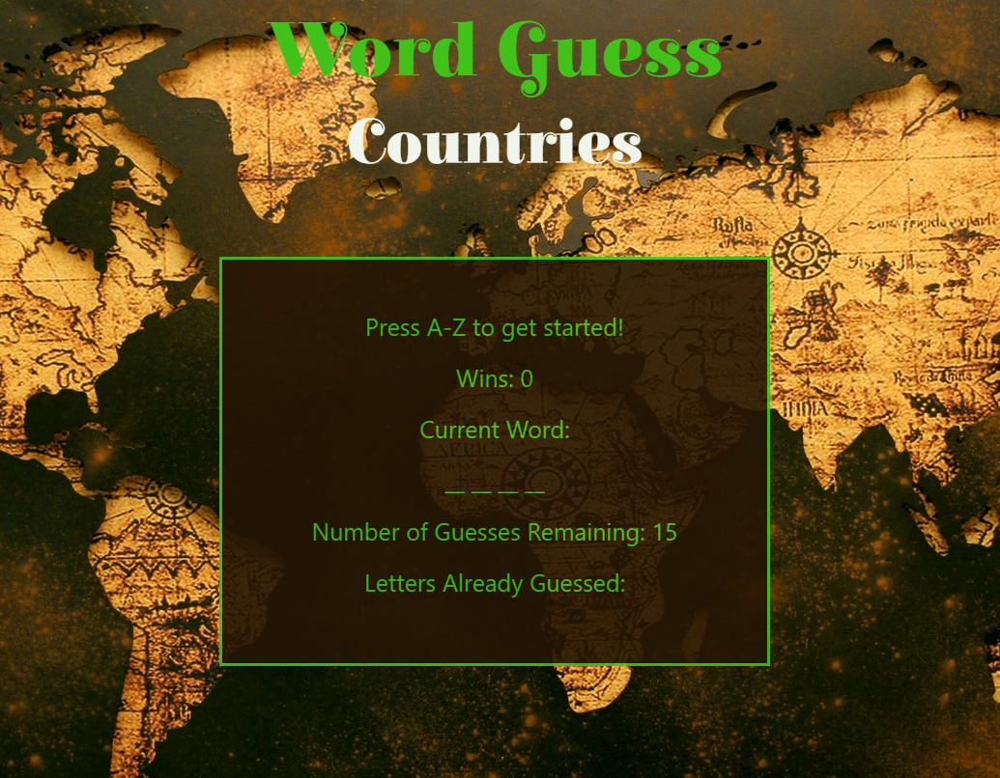

# Word-Guess-Game
This app is desinged to help people to learn names of countries around the world. The app will pick a random country and hide the letters. For each word user will be given 15 tries to guess a letter in the word. The app will count and display number of remaining guesses and letters already guessed. Each time user guesses a word it will add 1 point to the user. Once a word is guessed or if the user ran out of all remaining guesses the app will restart with a new word.  

### Technology used: 
* JavaScript 
* jQuery 
* HTML
* CSS 
* Bootstrap
* Google Fonts.
